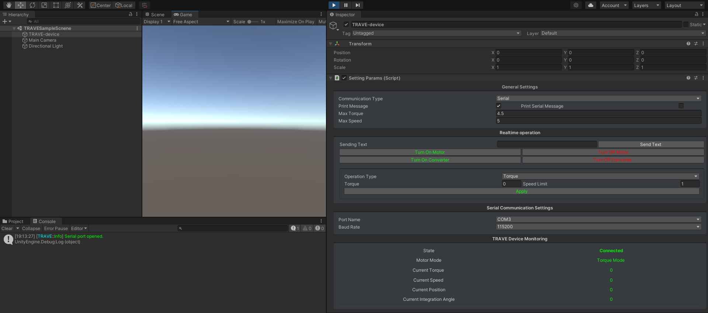

<a href="https://github.com/krocky-cooky/TRAVE_unity"></a>
# TRAVE_unity
[](https://github.com/krocky-cooky/TRAVE_unity/releases/tag/v0.0.1)
[](https://github.com/krocky-cooky/TRAVE_unity/blob/main/LICENSE)
[](https://open.vscode.dev/krocky-cooky/TRAVE_unity)

TRAVE_unity is device operation interface for TRAVE.

TRAVE project is supported by [MITOU foundation.](https://www.ipa.go.jp/jinzai/mitou/outline.html#:~:text=%E3%80%8C%E6%9C%AA%E8%B8%8F%E3%80%8D%E3%81%AF%E3%80%81%E7%B5%8C%E6%B8%88%E7%94%A3%E6%A5%AD,%E8%82%B2%E3%81%A6%E3%82%8B%E3%81%9F%E3%82%81%E3%81%AE%E4%BA%8B%E6%A5%AD%E3%81%A7%E3%81%99%E3%80%82)

## Install
Unity package is supported. 
Download unity package from [here](https://github.com/krocky-cooky/TRAVE_unity/releases) and import it.

## Usage
### Place the prefab in a scene

 Set up communication parameters.
### Operate from scripts
``` csharp
using UnityEngine;
using TRAVE;

public class SampleClass : MonoBehaviour
{
  TRAVEDevice device = TRAVEDevice.GetDevice();
  
  void Start()
  {
    //Make connection with TRAVE device if connection hasn't been made.
    if(!device.isConnected)
    {
     device.ReConnectToDevice()
    }
    
    //Set up torque mode to 1.0
    device.SetTorqueMode(1.0f);
    
    //Apply changes to TRAVE device
    device.Apply();
  }
 }
```
## API
### `TRAVEDevice`
Device operation API.

#### `static TRAVEDevice <TRAVEDevice>.GetDevice()`
Returns singleton instance of _TRAVEDevice_.  
_TRAVEDevice_ instance have to be initialized with this method.
##### Returns
- **out**: TRAVEDevice  
Singleton instance of _TRAVEDevice_.
```csharp
public class SampleClass 
{
  TRAVEDevice device = TRAVEDevice.GetDevice();
}
```

#### `bool <TRAVEDevice>.ReConnectToDevice()`
Reconnect to TRAVE device.
##### Returns
- **out**: bool  
if a connection has been made.

#### `void <TRAVEDevice>.SetTorqueMode()`
Set motor to torque mode and enter torque. (Change will not be applied without execution of `<TRAVEDevice>.Apply()` method)
##### Parameters
- **torque**: float
- **spdLimit**: float,optional  
Maximun value of speed. [default: 10.0f]
- **spdLimitLiftup**: float,optional  
Maximun value of liftup speed. [default: 10.0f]


#### `void <TRAVEDevice>.SetSpeedMode()`
Set motor to speed mode and enter speed. (Change will not be applied without execution of `<TRAVEDevice>.Apply()` method)
##### Parameters
- **speed**: float
- **trqLimit**: float,optional  
Maximun value of torque.[default: 6.0f]

#### `bool <TRAVEDevice>.Apply()` 
Apply changes to TRAVE hardware device.  
This method cannot be call more than 5Hz.
##### Parameters
- **forceChange**: bool,optional  
If true, force application regardless of the transmission interval.[default: false]
##### Returns
- **out**: bool  
If settings are successfully applied.

#### `bool <TRAVEDevice>.isConnected`
if the connection between PC and TRAVE device is made.

#### `string <TRAVEDevice>.motorMode`
Current motor mode.
Returns either "Torque Mode" or "Speed Mode".

#### `float <TRAVEDevice>.torque`
Current torque of the motor.

#### `float <TRAVEDevice>.speed`
Current speed of the motor.

#### `float <TRAVEDevice>.position`
Current position of the motor.

#### `float <TRAVEDevice>.integrationAngle`
Current integration angle of the motor.

## License
[MIT License](https://github.com/krocky-cooky/TRAVE_unity/blob/main/LICENSE)
